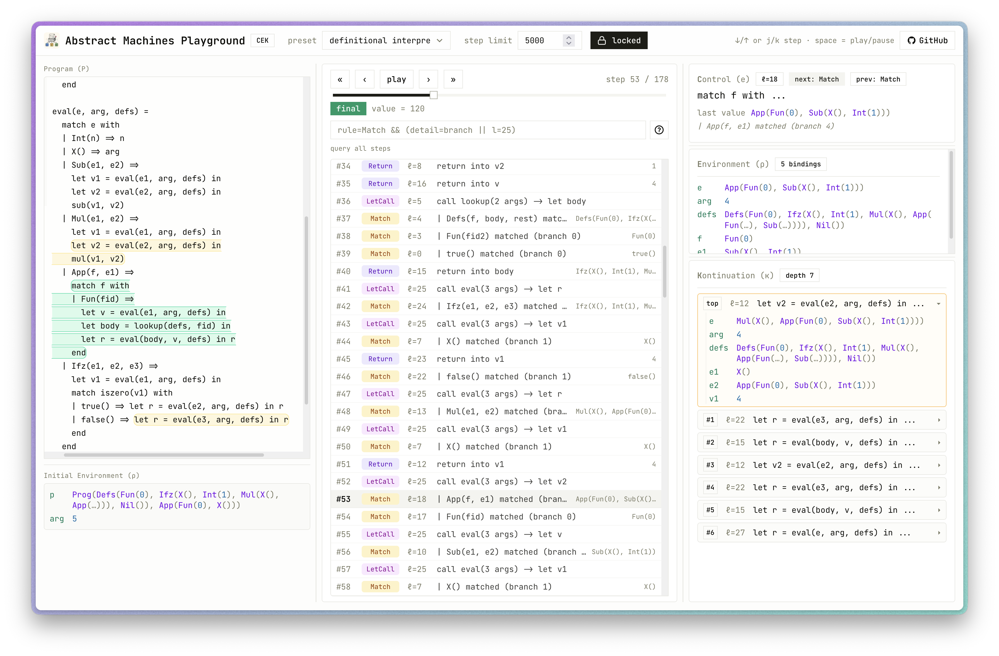

<span style="display: flex; align-items: flex-end; gap: 1em; padding-bottom: 0.5em;">
  
  <span style="font-size: 2em; font-weight: bold;">Abstract Machines Playground</span>
</span>

<p align="center">
  
</p>

An interactive environment for studying and testing [abstract machines](https://en.wikipedia.org/wiki/Abstract_machine) such as CEK machines by inspecting program execution traces.

The first machine shipped here is a CEK machine for a small language **S** (features ANF with constructor values, global mutually recursive functions, first-order pattern matching, and label-based control). Programs in another language **T** can be fed to an S-level definitional interpreter `I_S^T` by supplying T-ASTs as S constructor-value literals in the initial environment; the CEK trace is then a faithful small-step witness of running `I_S^T` on that T program.

## Quick start

```bash
bun install
bun run dev
```

Open [http://localhost:3000](http://localhost:3000) in your browser. A working example is preloaded.

## Language S cheat sheet

```
# Function definitions (sequence). One should be named `main`.
name(param, ...) =
  cmd

# Commands
let x = expr in cmd                # [LetExp]  or  [LetCall] if `expr` is a
                                   # call to a function defined in the program
assert expr in cmd                 # requires expr = true(); else stuck
match expr with                    # dispatch on constructor tag + arity
| Tag(x, y, ...) => cmd
| ...
end                                # `end` is required
expr                               # tail / return

# Expressions
42         -3           # integers
x                       # variable
Tag(e, ...)             # constructor value (UpperCase, or `true`/`false`)
prim(e, ...)            # primitive application (lowercase)
```

Primitives available out of the box: `add`, `sub`, `mul`, `iszero`, `eq`, `lt`, `not`. Extend the registry in [`lib/s/prims.ts`](lib/s/prims.ts).

### Running T programs

T has no concrete syntax in this tool; T ASTs are S constructor values. Supply the T program in the "initial ρ" tab using the same literal syntax:

```
p = Prog(Defs(Fun(0), Sub(X(), Int(1)), Nil()), App(Fun(0), Int(5)))
arg = 0
```

and run the preloaded `I_S^T` against them.

## CEK implementation notes

`lib/s/` is framework-free and exports the machine independent of the UI.

- [`lib/s/grammar.ts`](lib/s/grammar.ts) — Lezer grammar, built in-memory at module load with `@lezer/generator`'s `buildParser`. No extra build-step.
- [`lib/s/parser.ts`](lib/s/parser.ts) — walks Lezer's CST into a labeled AST (`Cmd`s get unique `Label`s, the `ControlMap` is populated on the way).
- [`lib/s/cek.ts`](lib/s/cek.ts) — implements the five transitions: `[LetExp]`, `[LetCall]`, `[Match]`, `[Assert]`, `[Return]`. `[Return]` recovers the bound variable by consulting `ctrl(ℓ_call)` on the continuation head.

Run a quick self-test:

```bash
bun run scripts/smoke-cek.ts
```

## Development commands

| Command | Description |
|---|---|
| `bun run dev` | Start the development server with Turbopack |
| `bun run build` | Create a production build |
| `bun run start` | Serve the production build locally |
| `bun run lint` | Run ESLint |
| `bun run typecheck` | Type-check without emitting output |
| `bun run format` | Format all `.ts`/`.tsx` files with Prettier |

## Adding shadcn/ui components

```bash
bunx shadcn@latest add <component>
```

Components are placed in `components/ui/`. Import them with the `@/` alias:

```tsx
import { Button } from "@/components/ui/button"
```

## Nix + direnv (optional)

A `flake.nix` is included that provides a reproducible shell with Bun. If you have [Nix](https://nixos.org/) and [direnv](https://direnv.net/) installed, the environment activates automatically when you enter the project directory:

```bash
direnv allow   # one-time setup
```

After that, `bun` is available in your shell without any manual activation.
